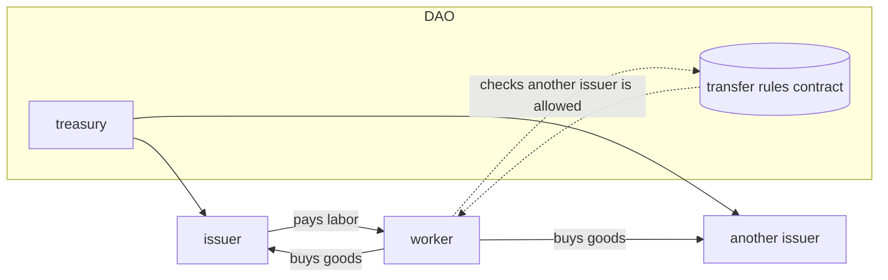
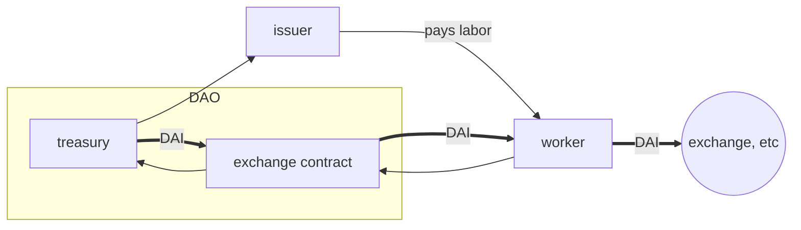

# Labor Token
Federated labor vouchers via crypto currency

# Purpose
For over a century the concept of a [labor voucher](https://en.wikipedia.org/wiki/Labour_voucher) has been seen as a
way to aid in the adoption of a transition from exploitative capitalism to socialism.

However, this has in practice been practically impossible for technical reasons.  Preventing the accumulation
and transfer of labor vouchers was either not possible, or required such a powerful and intrusive
state that came with overwhelming problems of its own.

We have seen with the rise of cryptocurrency, and especially in Smart Contracts in the 
EVM ecosystem, solutions that can indeed provide this capability without large amounts of
coercion.  Instead of having to discipline people, we can now create money that cannot
violate the principles of labor vouchers - and thus cannot be used for capitalist accumulation at
the expense of productive labor!

## Federation
Federation refers to the fact that labor tokens can be accepted by multiple organizations,
by the choice of the issuer.  This has several advantages . . .
- the value of the token to the holder is increased, since it can be used with multiple providers of goods or services
- the issuer does not need to satisfy all needs of the 
recipients, and instead can specialize in areas they have the
most expertise and capability in
- the holder does not have to worry that the issuer can control
their consumption and behavior.  Since there is always at least one
other organization that will accept the voucher for some value
  (LaborVoucher DAO), they have at least some value
- issuers can coordinate through the DAO to achieve overall
societal economic goals
- DAO assets can provide a value of the token outside of the ecosystem
- limited exchange for currency via the DAO can allow soft breaks, to enable
holders to interact with the existing capitalist economy while providing
an incentive to prefer in-network transactions

# Tokens
## HOUR
HOUR is the labor voucher token, and should correspond to the amount
of hours of labor done.  

It may also be issued as compensation
for capital injections, and the rate at which that is done will be
determined by the issuer.  However, if other organizations object
to this, they can refuse to accept tokens issued by that issuer.
In extreme cases, removal of the issuer and blacklisting of their tokens
by the DAO for exchange can also be done.

HOURs are held by the LaborToken DAO, and transferred to individual
issuers by vote of the DAO.  

### Rules
- HOURS can be sent from an issuer to any wallet.  It will store 
the wallet address of the issuer wallet it was transferred from.
- From a recipient wallet, HOURS can be transferred to
   1. The wallet of the issuer that sent them
  2. The wallet of the LaborToken DAO directly
  3. The exchange contract of the LaborToken DAO (at the rate decided by the DAO),
  in exchange for other currencies like BREAD, ETH or DAI
  4. The wallet of any other issuer recognized by the issuer
     5. The default behavior of issuers will be to accept tokens from other issuers
     6. whether a particular token can be used with another issuer is put in a smart contract
  function deployed within the DAO

#### Psuedo
- on transfer
    - call transfer_rules.is_issuer on sender
        - if issuer, they can send it
    - if not is_issuer, call transfer_rules.can_transfer_to_issuer with the address of the destination.
      - if true, allow transfer, otherwise do not

# Stakeholders
## Recipients
## Issuers

Issuers should not make tokens available as exchanges, etc.  They
are to be issued only for productive work or infusion of capital that benefits
their organization.

Issuers may be required to deposit reserves in the LaborToken DAO
in exchange for membership and assignment of HOURs to them.

Ideally an issuer would provide HOURS based upon the number of hours
a recipient works.  However, if an issuer wishes to differentiate
compensation based upon skills or other criteria, nothing in the currency
prevents that.  The DAO may decide to not allow this however.

Issuers may reuse HOURs as much as they wish.  Ideally an organization
would quickly reach a steady state, where the work done by the labor is paid 
out in HOURS, and the prince in HOURS of goods and services consumed within the network from the production
of the issuer match.

### Net imbalances of issuers
How to address a long-running inflow or outflow of HOURS from other issuers will
be handled through the DAO, but does serve to quantify 
imbalances of production.

### LaborToken DAO
The Labor Token DAO is made up of all issuers of the LaborToken.
It can add new members (who are then able to issue and receive the LaborToken HOURS),
and does so by adding them as a signatory on the LaborToken DAO.  

If the LaborToken DAO wishes to give additional 
representation to an issuer, they can recognize additional
wallets for that issuer.

In cases where an issuer needs to be removed, that likewise
is controlled by voting in the DAO.

All members have voting rights, with one vote per wallet.

It is currently setup using the [Aragon](https://aragon.org) platform on the 
Arbitum blockchain.  This enables low cost transfers and voting.

# System
Basic trade within the system


Worker exchanges HOURS for DAI to use externally.  Note that the exchange will likely be offering a lower price
in DAI than the HOURS could buy of goods and services from the issuer!



## Treasury
The Treasury is a multi-sig wallet controlled by the LaborToken DAO.  It holds unused HOURS, as well as reserves for the
exchange and support from members.  

The treasury is currently located at 0xa7353da910d6c42bd57608c006782e9d2f1940b1 on the Arbirtrum chain.

### Investment wallet
In cases where the LaborToken DAO has enough excess funds, there can be additional multisig wallets that will be used
to lend out funds and gain interest (as per the [BreadChain project](https://breadchain.xyz)).   This should not
become a large part of the org, as we wish the currency instead to drive internal trading of non-capitalist ventures.  
Holding for interest, and currency speculation in general, will cause a conflict of interest with our primary mission
of building a non-capitalist, non-exploitative economy.

### Capital Wallet
In case of excess reserves, funds may be moved from the Treasury main wallet to funds for capital investment of members
or the platform.  These will be held separate to ensure that the reserves are not impacted.

## Transfer Rules Contact
This is a simple smart contract which exposes functions to ensure that tokens only transfer according to rules.

Given the wallet of an issuer (which is stamped on any issued token), return a list of all the wallets that will accept
this token, along with a friendly name. 

- by default, the contract will allow any wallet with the LaborToken DAO Membership token to accept the HOURS
   - issuers may blacklist or require whitelist, however, which will remove this
   - if blacklisted, the blacklisted wallet will never be returned
        - LaborDAO treasury may not be blacklisted
   - if whitelisting enabled, only those listed for the issuer, and the LaborToken DAO wallet, will be returned 

Also, given the wallet of an issuer and another wallet (intended receiver), return a boolean if transfer to the receiver
is permitted.

### Methods
- is_issuer(address) -> bool:
    returns if a wallet address is an issuer or not

- can_transfer_to_issuer(to: address, from: sender_address, token_issued_by: address) -> bool:
  if you can transfer labor tokens from the sender to the destination or not

   ```
   if to is labor_dao treasure or excange:
      return true
   if to is not issuer:
      return false
   if to enables whitelist:
      if token_issued_by is on whitelist, return true
      else false
   else
      if to has blacklist:
         if token_issued_by not on blacklist return true
      return true
   ```


### Updates
This contract is updatable by vote of the LaborToken DAO, and will be updated each time a whitelist or blacklist changes.

## Exchange Contract
This allows holders of HOURS to swap them for external cryptocurrencies, like DAI or ETH.  

### Exchange rate
The exchange rate is part of the contract.  To determine this, we will take the total value of the treasury, divided by the number 
of HOURS tokens existing, and multiply this by a factor called the **preference factor**.  This will represent the incentive given
to keep using HOURS over exchanging them to the outside world.

### Updates
This contract is updatable to allow changes to exchange rates.
